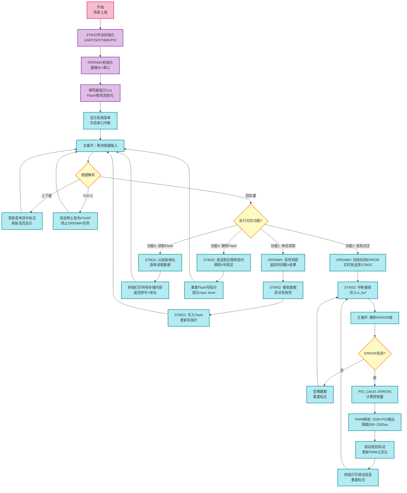

# 2602task STM32+OPENMV 单目测距&PID舵机对正系统 - README
> 控制组寒假培训项目 | 嵌入式中断驱动开发 | 视觉闭环控制
## 项目概述
本项目基于**STM32G431C8T6主控**+**OPENMV H7视觉模块**实现四大核心功能：单目测距、PID舵机标靶对正、SPI Flash数据存储/擦除、终端人机交互Shell。全程采用**中断驱动+主循环轮询**架构，彻底解决传统轮询的阻塞问题，同时完成SPI外设、位置式PID控制、终端交互的全流程实践，代码均附带详尽规范注释。

## 项目文档说明
本仓库附带3份核心技术文档，覆盖**流程、代码、实现细节**，与工程代码一一对应，便于快速理解项目逻辑：
1. **流程图.docx**：系统整体执行流程图（Mermaid代码+配套技术说明），清晰展示初始化、人机交互、四大功能分支的完整逻辑
2. **2602task技术文档.docx**：项目总技术文档，包含系统架构、软硬件实现、PID算法设计、功能测试与注意事项，是项目核心说明文档
3. **代码函数功能与交互说明.docx**：OPENMV(Python)和STM32(C)全函数解析，详细说明各函数**作用、实现思路、调用关系、数据交互**，适配代码阅读与复盘

## 系统总流程图
采用Mermaid标准化语法编写，与实际代码执行逻辑完全一致。

### STM32G431C8T6 外设接线表
| 外设模块         | 外设引脚/接口 | STM32引脚 | 信号类型       | 功能说明                                  |
|------------------|--------------|-----------|----------------|-------------------------------------------|
| OPENMV（串口通信）  | TX   | PA10    | USART1_RX   | 接收OPENMV发送的测距/ERROR数据              |
| OPENMV（串口通信  ）| RX    | PA9    | USART1_TX   | 向OPENMV发送功能指令（b'0'/b'1'/b'\x00'）   |
| W25Q64（SPI Flash）| CS  | PB0    | GPIO_Output   | SPI3片选控制，低电平选中Flash               |
| W25Q64（SPI Flash）| SCK | PB3   | SPI3_SCK       | SPI3时钟信号                               |
| W25Q64（SPI Flash）| MISO| PB4    | SPI3_MISO     | STM32接收Flash数据                         |
| W25Q64（SPI Flash）| MOSI| PB5   | SPI3_MOSI      | STM32向Flash发送数据/指令                   |
| MG90S舵机          | PWM | PA2    | TIM2_CH3      | 接收PWM信号，控制舵机角度                   |
| 无源蜂鸣器         | PWM| PB1  | TIM3_CH4         | 接收PWM信号，驱动蜂鸣器鸣叫                  |
| 上位机（串口交互）  | TX   | PA3    | LPUART1_RX   | 接收上位机按键数据（上下键/回车/Ctrl+C）      |
| 上位机（串口交互）  | RX  | PA2     | LPUART1_TX   | 向上位机发送菜单/调试/数据打印信息            |

---

### OPENMV H7 引脚配置说明（我的是这样的，但是不一定别的版本也是这样的）
| OPENMV引脚 | 功能类型       | 连接对象       | 作用说明                                    |
|------------|----------------|----------------|-------------------------------------------|
| P0         | UART1_TX       | STM32 PA10     | 向STM32发送测距结果（timestamps:XXX）/ERROR值  |
| P1         | UART1_RX       | STM32 PA9      | 接收STM32的功能指令（b'0'=测距，b'1'=舵机对正） |
| 5V         | 电源输入       | 外部5V电源     | OPENMV供电（不可接3.3V，会导致供电不足）         |
| GND        | 地             | STM32 GND      | 与STM32共地，保证串口通信稳定                   |
| USB口      | 程序下载/调试  | 电脑USB        | 下载Python代码、调试视觉检测效果                 |

### 我的核心技术的进步与反思
- **中断驱动**：双串口（LPUART1/USART1）中断接收，区分人机交互与视觉数据，配置中断优先级保证实时性，自研非阻塞延时函数替代HAL库阻塞延时
- **PID闭环控制**：位置式PID实现舵机对正，采用”积分限幅+反馈式补偿法“抗积分饱和，有效解决舵机超调/震荡问题
- **SPI Flash驱动**：采用W25Q64，支持单/多字节读写、字符串封装、跨页写入处理，完成测距数据持久化存储
- **终端交互Shell**：实现带高亮的动态菜单、按键解析、任务实时中断（Ctrl+C），ANSI指令优化终端显示效果
- **视觉检测**：OPENMV实现标靶识别、单目测距（相似三角形原理）、偏移量（ERROR）实时检测，与STM32通过固定格式串口通信

## 硬件与开发环境
### 核心硬件清单
| 模块         | 型号/规格          | 通信/控制方式                     |
|--------------|--------------------|----------------------------------|
| 主控单元     | STM32G431C8T6      | USART1连OPENMV，LPUART1连上位机  |
| 视觉单元     | OPENMV H7          | USART1，115200波特率8N1          |
| 执行单元     | MG90S舵机          | TIM2_CH3 PWM输出（1500us对应0°） |
| 存储单元     | W25Q64 SPI Flash   | SPI3通信，片选PB0，单扇区4KB     |
| 提示单元     | 无源蜂鸣器         | TIM3_CH4 PWM频率调制              |

### 开发环境
- STM32：CubeMX（外设配置）+ Keil MDK-ARM（代码编写/编译）
- OPENMV：OPENMV IDE（Python代码编写/下载）
- 串口调试：XCOM/SSCOM（波特率115200，8N1）

## 快速使用说明
1. 硬件连接：按文档完成各模块接线，确认无虚接/接反
2. 程序下载：分别将STM32和OPENMV程序下载至对应硬件
3. 串口调试：打开串口终端，波特率115200，上电后蜂鸣器提示1s，终端显示功能菜单
4. 功能操作：
   - 上下键：选择功能菜单，高亮标志跟随移动
   - 回车键：确认执行选中功能
   - Ctrl+C：中断当前舵机对正任务，返回菜单

## 注意事项
1. 串口参数：STM32与OPENMV的USART1波特率必须均为115200，否则出现数据乱码
2. 标靶要求：5cm边长纯黑正方形标靶，无白边，避免检测干扰
3. 环境要求：光线稳定、背景干净，防止OPENMV检测偏差
4. 舵机限位：转动范围限制在-45°~+45°，避免机械限位导致PID调试误差
5. Flash操作：W25Q64最小擦除单位为4KB扇区，擦除后数据不可恢复

---
> 本项目为我的嵌入式入门实践项目，全程代码与文档均附带详尽注释，便于学习与二次开发。
（仅供学习参考我也不能保证百分之百靠谱   嘻嘻~）
